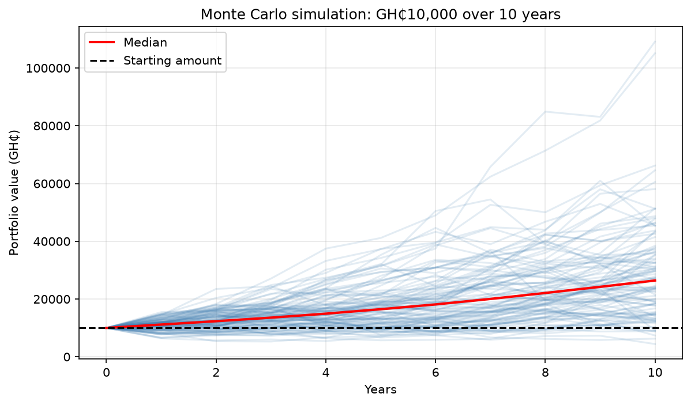

# Monte Carlo Portfolio Simulator

A Python tool that simulates thousands of possible futures for an investment, so you can see the range of outcomes instead of a single guess.

## What it does
- Runs 5,000 simulated investment paths using random yearly returns
- Reports the worst 10%, median and best 10% outcomes
- Shows the chance of losing money
- Plots 100 sample paths with the median highlighted
- Caps yearly losses at 100%, so a portfolio never goes below zero

## How to run
1. Install Python 3
2. Install the libraries: `py -m pip install numpy matplotlib`
3. Clone this repo
4. Run `py simulate.py` and enter your numbers

## Inputs
- Amount to invest (GH₵)
- Expected yearly return (%)
- Yearly volatility, meaning how risky the investment is (%)
- Number of years

## What I learned
Higher risk spreads the outcomes out. With a 5% expected return and 40% volatility, the median portfolio ended below the starting amount even though the average return was positive, because large losses hurt more than equal gains help.

## How it works
Each year's return is drawn from a normal distribution with the chosen mean and volatility. Yearly returns are multiplied together to get each path, and this is repeated 5,000 times.

## Roadmap
- Compare several portfolios side by side
- Add yearly contributions

## Author
Claudia Lartey
